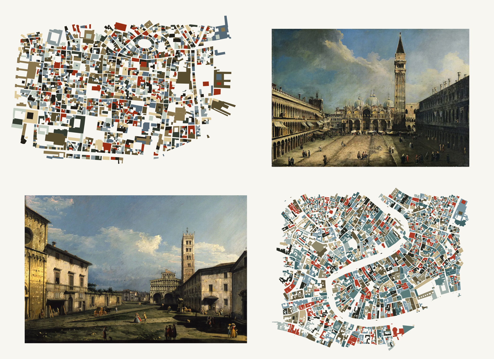
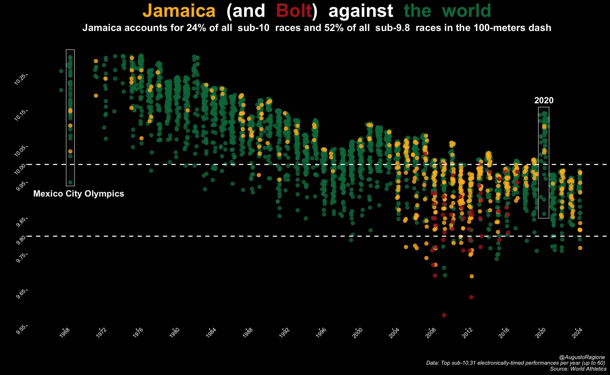
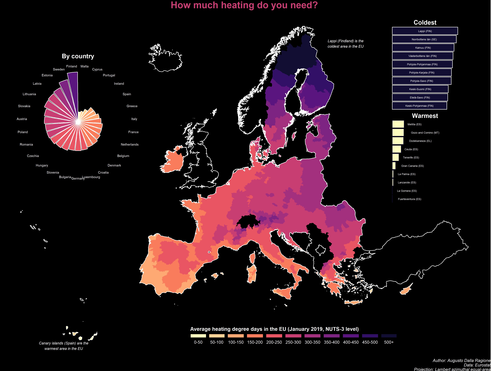

# Data visualization and maps

I sometimes create data visualizations and maps as a hobby. You can find some of my attempts at portraying data in an aesthetically-pleasing way here. All data visualizations are produced with R, and the scripts used to generate them can be found [here](https://github.com/ADR1993/heterogony-of-ends).  

## Lucca and Venezia

Lucca definitely doesn't come to mind when people think about cities that might look similar to Venezia. It actually is quite similar, though, in the way the labyrinthic structure of narrow and sometimes suffocating medieval streets abruptly eases into wide, open squares, without warning the wanderer. This painting/map collage is intended as a tribute to this approach of playing with space and its expectations. It is also a token of reciprocation, as these two cities were kind enough to provide the stage to some relevant personal events. 

On the bottom left, a view of Piazza San Martino in Lucca, by Bernardo Bellotto (1740).
On the upper right, a view of Piazza San Marco in Venezia, by Canaletto (1723; Canaletto who was actually Bellotto's uncle!).

## Top performances in 100-dash men over time

A scatterplot to highlight Jamaica's domination of sprinting in the past 20 years, especially in Bolt's era, with data scraped from World Athletics. 

## Heating degree days in the European Union

- [Home](README.md)
