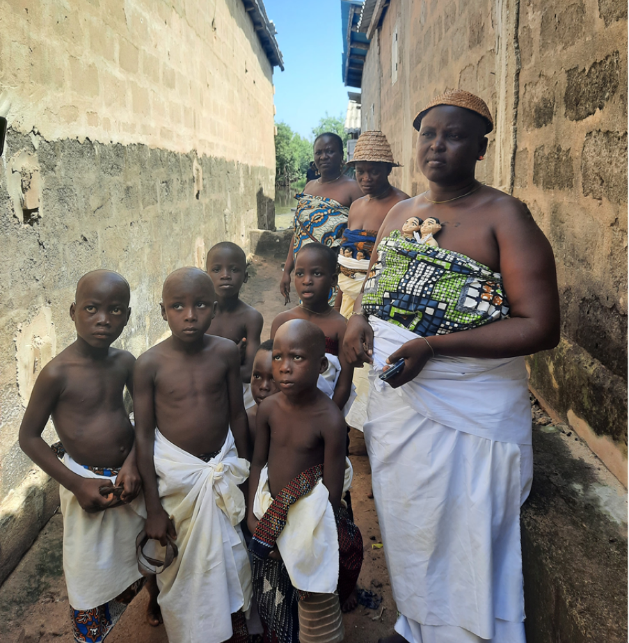
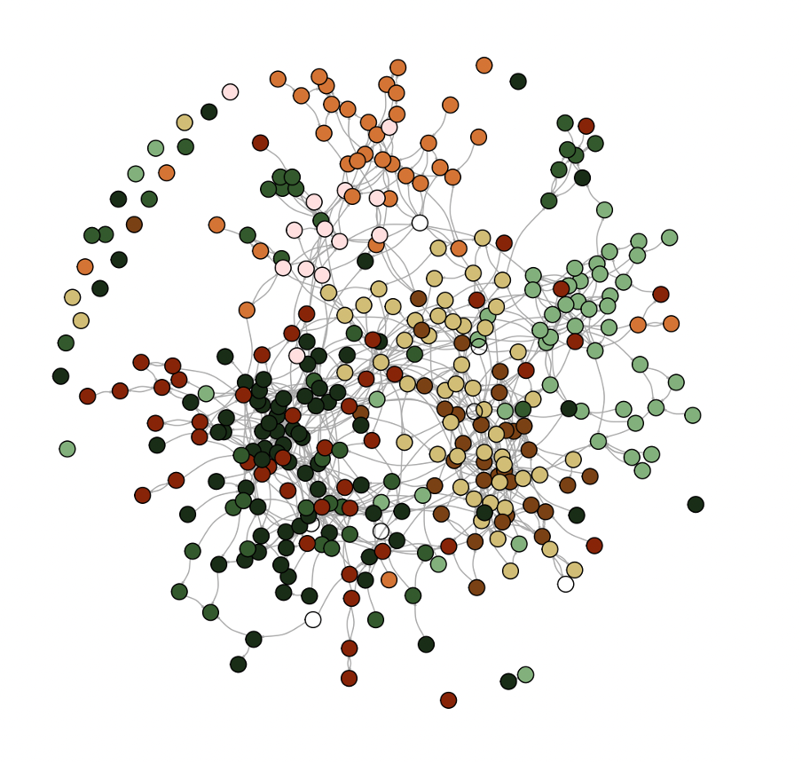

# Research interests

Below is a brief and non-exhaustive review of my current research interests.

## Fieldwork in Benin

During the course of my doctorate I set up a data collection project in two villages in Benin, West Africa. The collected data include information on basic demography, anthropometric measurements, reproductive and marital histories, kinship, household wealth and assets, personal income and economic activities, education and linguistic skills, health and well-being, cultural beliefs and social norms about fertility and twinship, social networks, as well as data on behavior in [networked economic games](https://journals.sagepub.com/doi/full/10.1177/1525822X16643709?casa_token=dDGNkYBI6gEAAAAA%3AZ745MZlgwdzckKMdEjXLxFIeDPAZ52N_3kFHjkC58xGAeRzZr0HBAaeYeMpZ1z7wA0YgP3lRurWNAQ). 

## Twinship

Dizygotic (DZ) twinning rates display a large between-population variation, with the highest incidence found in West and Central Africa. Given the multi-factorial etiology of DZ twin births, it's unlikely that a single cause may explain such an appreciable variation. However, DZ twinning is known to be genetically heritable, with consequences that are sometimes [very evident at the population level](https://journals.plos.org/plosone/article?id=10.1371/journal.pone.0020328). 

The continued existence of twinning is a bit of an evolutionary puzzle in itself. Given its significant biological costs, which would lead us to expect that natural selection would remove genotypes conducive to higher propensity to give birth to twins. According to the most established hypothesis, twinning might be maintained in the population because of natural selection favours some levels of polyovulation to offset embryo/foetal mortality, of which twinning is a "harmful" side effect.

At the same time, twinning is also highly culturally salient in several societies in this "high-twinning" region of Sub-Saharan Africa, where the birth of twins may have both positive (*geminophilia*) and negative valence (*geminophobia*), depending on the group. Geminophilous groups assign a special status to twins, attributing them the ability to bestow wealth and good luck over their family and increasing the prestige of their parents. Geminophobic groups, on the other hand, used to shun and ostracize twins, sometimes to the point of allowing the infanticide of one of them, or both.

We (me and my supervisors) hypothesize that a dynamic of gene-culture co-evolution might explain the high incidence of twin births in parts of Sub-Saharan Africa. Cultural strategies such as geminophilia (a support system to twins masked as a set of supernatural beliefs and practices) and geminophobia (the possibility of disposing of one twin to allocate parental resources to the other) might have emerged to deal with the adaptive problem posed by twin births, and could have been able to "subsidize" higher frequencies of the alleles underlying polyovulation. We presented the (verbal) argument [here](https://www.cambridge.org/core/journals/evolutionary-human-sciences/article/geneculture-coevolutionary-perspective-on-the-puzzle-of-human-twinship/E81184315552107BF5D2C203052B7F30), and are currently working on developing a formal model of the co-evolutionary dynamic.

## Fertility norms, social networks, and demographic transition

Demographic transition / fertility decline is an enduringly popular topic of research for demographers, economists, anthropologists, and social scientists, regardless of whether it is looked at through an evolutionary lens or not. 
Among the countless theorized mechanisms that can trigger declines in fertility, a cultural evolutionary explanation focuses on the spread of fertility norms through networks, and the changes that economic modernization apparently brought on individual's social networks. 
Higher residential mobility through times of modernization arguably reduced the density of kin in one's network. 
If fertility norms and preferences do spread through communication networks, and relatives are more likely to transmit high-fertility norms to each other than to non-kin (as they have a vested fitness interest in their kin's reproductive success), we might observe declines in preferences for larger families as the density of kin in people's social networks declines.
This suggests that the effect of kin reduction on fertility may extend *beyond* the loss of family support and childcare—it may also influence underlying fertility preferences through the transmission of cultural norms.
Hopefully, the analysis of the data collected in small-scale communities in Benin might help to shed light on how fertility preferences might be affected by the structure of individuals' social networks.

## Religion and prosociality

What are the evolutionary origins of religious and supernatural beliefs? Scholars are still debating that. Whatever the cognitive underpinnings of religious belief may be, religions are also institutions prescribing sets of norms that regulate how their adherents' navigate natural and social environments. As such, the institution of religion itself may be subject to (cultural) selective pressures if those norms bring about differences in payoffs. For example, the belief in moralizing deities (gods that are omniscient and morally concerned) has been argued to have played a pivotal role in "scaling up" cooperation, sustaining high levels cooperation and altruism in large groups which would otherwise face significant monitoring and punishment costs to discourage defectors. Data collected in Benin, which include behavioural games, prosociality vignettes, and detailed information on religious beliefs and practices, might contribute to our understanding of how religion can impact prosocial behaviour, and test whether moralizing deities indeed do "expand the scope of sociality".

To this aim, I am part of the [Gods, Games, and the Socio-Ecological Landscape](https://pure.au.dk/portal/en/projects/gods-games-and-the-socioecological-landscape) project, which coordinates fieldworkers across religiously diverse societies to test these long-standing questions about religions and prosociality. 

## Network data collection

The search for quick and efficient ways to collect data from a relatively large number of interviews led me and colleagues to develop a simple KoboCollect-based name-generator method to acquire recall-based sociocentric network data.
Recall-based methods of data collection rely on the respondent to nominate alter with whom they have social ties (e.g., who are you friend with?). 
These methods may require significant post-processing effort, however, since nominations have to be carefully cross-checked to resolve alters' identities, which can take lots of time and is an inherently error-prone process.
Our protocol is based on a photograph roster of the entire community/sample which is used for immediate identity confirmation from the respondent themselves.
For example, if an individual says they are friends with Giuseppe Garibaldi, the interviewer can do a name search and retrieve the photographs associated with the name "Giuseppe Garibaldi" in the KoboCollect app, and ask the respondent to confirm the nomination by looking at the photograph.
An R package, [`XLSFormulatoR`](https://github.com/ADR1993/XLSFormulatoR), which automates the creation of network questionnaires is also presented, to facilitate researchers who may not want to devote too much time to the frustrating XLSForm syntax (the language in which KoboCollect questionnaires are written).
The preprint that presents the method can be found [here](https://osf.io/preprints/socarxiv/gna3d).

- [Back to Home](README.md)
